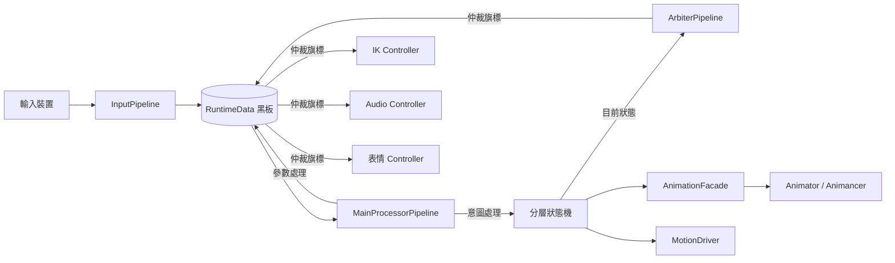

# CharacterController 架構設計文件

> 狀態：草稿 v0.2
> 最後更新：2026-06-29
> 作者：Baka8787

---

## 1. 專案目標

### 1.1 這是什麼
一個資料驅動的 Unity 第三人稱角色控制器框架
目標是徹底分離「邏輯決策」與「表現執行」。

### 1.2 為什麼要做這個（問題陳述）
傳統角色控制器常見的問題：
- 輸入、狀態、動畫事件、音效全部耦合在同一份腳本裡
- 新增一個動作/武器，要到處改現有程式碼，容易牽一髮動全身
- 狀態切換用大量 if-else 或 bool flag 堆疊，難以追蹤「誰能打斷誰」

### 1.3 這個專案要解決到什麼程度（Scope）
- [ ] 必須做到：____
- [ ] 盡量做到：____
- [ ] 不在這次範圍內（Out of Scope）：____

> 建議先填這一欄再往下寫，避免規格越寫越大導致做不完。

---

## 2. 核心設計理念

### 2.1 兩股資訊流：意圖（Intent）與參數（Parameter）

| | 意圖 (Intent) | 參數 (Parameter) |
|---|---|---|
| 定義 | 這一瞬間「想」做什麼 | 這一帧用來驅動表現的連續數值 |
| 範例 | 按下跳躍鍵、按下開火鍵 | 移動速度、視角角度、上半身權重 |
| 生命週期 | 通常單帧觸發，當帧處理完即復位 | 持續存在，每帧更新 |
| 誰來讀 | 狀態機（決定要不要切換狀態） | 動畫層、IK 層（決定怎麼表現） |

**為什麼要分開？**
[在這裡寫下你自己的理解 / 之後實作後回頭補充的心得]

### 2.2 資料中心黑板（Blackboard）模式
- 所有模組只讀寫 `RuntimeData`，不直接互相呼叫
- 好處：____
- 代價／要注意的地方：____（例如：黑板過度肥大、誰該擁有寫入權需要規範）

### 2.3 分層狀態機
- FullBody / UpperBody / Override 三層的職責邊界
- 為什麼不用單一狀態機處理所有動作？

### 2.4 表現層解耦（Facade 模式）
- 玩法邏輯不應該知道「動畫機是 Animancer 還是 Animator」
- Facade 的介面該長什麼樣子？

### 2.5 仲裁層（ArbiterPipeline）

角色在某些特殊狀態下（死亡、被控制、離相機太遠），不是「要播什麼動畫」的問題，而是「要不要允許某個表現層模組繼續運作」的問題。

如果讓各個 Controller（IK、音頻、表情）自己讀狀態機目前的狀態來判斷，就會變成原問題陳述的老毛病——到處寫死依賴、牽一髮動全身。

仲裁層的職責是：**把「能不能」這件事，從各模組各自判斷，收斂成一個單一決策點。**

資料流如下：
```
狀態機（知道目前是什麼狀態）
  → ArbiterPipeline（依狀態轉譯成仲裁旗標）
  → RuntimeData.Arbitration（寫入黑板的仲裁區）
  → 各 Controller（只讀旗標，不問為什麼）
```

這與黑板模式的精神一致：下游模組只看黑板上的資料辦事，不直接詢問上游模組的內部狀態。仲裁旗標就是黑板上繼「意圖」「參數」之後的第三種資料類型。

**實作時機**：第四階段（仲裁器與打斷系統），狀態機完成後再接入。

---

## 3. 系統架構圖

> 用 Mermaid 畫，GitHub 上可直接渲染



[依實作進度持續更新此圖]

---

## 4. 模組職責邊界

> 每個模組寫清楚「該做什麼」跟「不該做什麼」，避免職責蔓延

### 4.1 InputPipeline
- 該做：採樣輸入裝置、做輸入緩衝/一致性處理、寫入意圖到黑板
- 不該做：不該知道狀態機目前在哪個狀態、不該直接觸發動畫

### 4.2 RuntimeData（黑板）
- 該做：承載當帧意圖、參數快取、裝備/瞄準引用、仲裁旗標
- 不該做：不該包含邏輯方法（只存資料，不做決策）

### 4.3 狀態機（State Machine）
- 該做：依黑板資料決定要不要切換狀態、管理進入/退出條件、將目前狀態資訊提供給 ArbiterPipeline
- 不該做：不該直接操作動畫播放細節（要透過 Facade）、不該直接去開關各個 Controller

### 4.4 AnimationFacade
- 該做：統一動畫播放介面，隔離底層動畫系統差異
- 不該做：不該包含遊戲邏輯判斷

### 4.5 ArbiterPipeline（仲裁管線）
- 該做：接收狀態機目前狀態，統一計算並寫入 `RuntimeData.Arbitration` 仲裁旗標（如 `BlockInput`、`BlockIK`、`BlockAudio`）
- 不該做：不該直接呼叫任何表現層 Controller 的方法（只能透過寫黑板旗標溝通）、不該包含狀態切換邏輯（那是狀態機的職責）

### 4.6 表現層 Controller（IK / Audio / 表情等）
- 該做：每帧讀取 `RuntimeData.Arbitration` 對應旗標，決定自己要不要執行本帧的更新
- 不該做：不該直接詢問狀態機目前在哪個狀態、不該自己包含「死亡時停止」這類判斷邏輯（那是仲裁層的職責）

---

## 5. 關鍵設計決策與 Trade-off

> 這一節是面試時最容易被問到的地方：「為什麼這樣設計？有沒有想過別的做法？」

| 決策 | 選擇 | 替代方案 | 為什麼選這個 | 代價 |
|---|---|---|---|---|
| 動畫系統 | Unity Animator + 自製 Facade | Animancer | 免授權費，先求架構驗證；未來只需修改 Facade 內部即可切換 | 程式碼控制力較弱（無法直接做 state blending），之後可能要換 |
| 狀態機表示法 | ScriptableObject 配置 | 純程式碼 enum + switch | | |
| 黑板實作 | 單一 class 集中持有 | ECS / 元件式資料 | | |
| `InputData` 物件複用策略（v0.1） | `PlayerInputSource` 持有單一 `private readonly InputData` 實例，每帧覆寫後回傳同一參考 | 每帧 `new InputData()` | 避免每帧 GC Alloc | **鬼影資料風險（Aliasing）**：回傳的是參考而非拷貝，若被外部跨帧持有將隨下一帧被覆寫；已規劃以 `ref struct` 重構消除此風險（見 02-dev-spec.md 1.3 節） |
| `InputData` 型別升版（v0.2 已執行） | 改為 `ref struct`，`IInputSource` 簽名改為 `void FetchRawInput(ref InputData data)` | 維持可變 class | 徹底消除 Aliasing 風險，stack-only 語意保證不會被跨帧持有；對齊原作者零 GC 設計方向 | `ref struct` 不能裝箱、不能用於 async/迭代器、不能被 class 持有為欄位；為破壞性變更，需同步修改 `IInputSource`、`PlayerInputSource`、`CharacterPipelineRunner` 三處。實作後用 Profiler 量測 GC Alloc 差異補入此欄 |
| Intent/Parameter 處理器內嵌在 Runner | 以 private method 寫死在 `CharacterPipelineRunner` | 抽成 `IIntentProcessor` / `IParameterProcessor` 介面，Runner 持有 List 逐一呼叫 | 地基階段邏輯量小，先求資料流跑通，避免過早抽象 | 與規格文件隱含的可插拔設計不一致；**重構訊號**：任一 method 超過 10-15 行判斷邏輯時執行（見 02-dev-spec.md 3.1 節） |
| 仲裁層設計 | 獨立 `ArbiterPipeline`，統一寫入黑板仲裁旗標，下游 Controller 只讀旗標 | 各 Controller 自行讀狀態機狀態判斷 / 狀態機直接開關 Controller | 維持單一決策點，新增表現層模組不需要修改狀態機；旗標語意清晰（`BlockIK = true` 比 `currentState == DeadState` 更不依賴具體狀態實作） | 多一層間接（狀態 → 仲裁旗標 → Controller），若旗標粒度設計過細會讓黑板變肥；**實作時機**：第四階段，狀態機完成後再接入 |

[每完成一個重大決策就補一行，越早寫越不會忘記當時的考量]

---

## 6. 效能目標（可選，視時間決定要不要做到這層）

- [ ] 角色邏輯每帧耗時目標：____
- [ ] 是否要求零 GC（持續運行階段）：____
- [ ] 物件池涵蓋範圍：____

---

## 7. 開放問題 / 待決事項

> 還沒想清楚但要記下來的問題，避免之後忘記

- [ ] 上半身打斷與全身打斷的優先順序衝突時怎麼處理？
- [ ] IK 要不要在這次 demo 範圍內做？
- [ ] 仲裁旗標的粒度：單一 `BlockAll` 旗標 vs 每個 Controller 各自一個旗標（`BlockIK` / `BlockAudio` / `BlockInput`）？粒度越細越靈活但黑板越肥。
- [ ] ArbiterPipeline 要不要支援「優先級疊加」（多個來源同時要求封鎖，解鎖需全部來源同意）？還是簡單的單一旗標就夠？

---

## 8. 修訂紀錄

| 日期 | 版本 | 變更內容 |
|---|---|---|
| 2026-06-28 | v0.1 | 初版骨架建立 |
| 2026-06-29 | v0.2 | 補充仲裁層設計理念（2.5）、更新架構圖加入 ArbiterPipeline、補充 4.5/4.6 模組職責邊界、Trade-off 表補入鬼影資料風險、ref struct 升版、Pipeline 處理器抽介面、仲裁層決策共四筆、開放問題補充仲裁旗標粒度議題 |