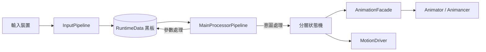

# CharacterController 架構設計文件

> 狀態：草稿 v0.1
> 最後更新：2026-06-28
> 作者：Baka8787

---

## 1. 專案目標

### 1.1 這是什麼
一個資料驅動的 Unity 第三人稱角色控制器框架
目標是徹底分離「邏輯決策」與「表現執行」。

### 1.2 為什麼要做這個（問題陳述）
傳統角色控制器常見的問題：
- 輸入、狀態、動畫事件、音效全部耦合在同一份腳本裡
- 新增一個動作/武器，要到處改現有程式碼，容易牽一髮動全身
- 狀態切換用大量 if-else 或 bool flag 堆疊，難以追蹤「誰能打斷誰」

### 1.3 這個專案要解決到什麼程度（Scope）
- [ ] 必須做到：____
- [ ] 盡量做到：____
- [ ] 不在這次範圍內（Out of Scope）：____

> 建議先填這一欄再往下寫，避免規格越寫越大導致做不完。

---

## 2. 核心設計理念

### 2.1 兩股資訊流：意圖（Intent）與參數（Parameter）

| | 意圖 (Intent) | 參數 (Parameter) |
|---|---|---|
| 定義 | 這一瞬間「想」做什麼 | 這一帧用來驅動表現的連續數值 |
| 範例 | 按下跳躍鍵、按下開火鍵 | 移動速度、視角角度、上半身權重 |
| 生命週期 | 通常單帧觸發，當帧處理完即復位 | 持續存在，每帧更新 |
| 誰來讀 | 狀態機（決定要不要切換狀態） | 動畫層、IK 層（決定怎麼表現） |

**為什麼要分開？**
[在這裡寫下你自己的理解 / 之後實作後回頭補充的心得]

### 2.2 資料中心黑板（Blackboard）模式
- 所有模組只讀寫 `RuntimeData`，不直接互相呼叫
- 好處：____
- 代價／要注意的地方：____（例如：黑板過度肥大、誰該擁有寫入權需要規範）

### 2.3 分層狀態機
- FullBody / UpperBody / Override 三層的職責邊界
- 為什麼不用單一狀態機處理所有動作？

### 2.4 表現層解耦（Facade 模式）
- 玩法邏輯不應該知道「動畫機是 Animancer 還是 Animator」
- Facade 的介面該長什麼樣子？

---

## 3. 系統架構圖

> 用 Mermaid 畫，GitHub 上可直接渲染

[依實作進度持續更新此圖]

---

## 4. 模組職責邊界

> 每個模組寫清楚「該做什麼」跟「不該做什麼」，避免職責蔓延

### 4.1 InputPipeline
- 該做：採樣輸入裝置、做輸入緩衝/一致性處理、寫入意圖到黑板
- 不該做：不該知道狀態機目前在哪個狀態、不該直接觸發動畫

### 4.2 RuntimeData（黑板）
- 該做：承載當帧意圖、參數快取、裝備/瞄準引用
- 不該做：不該包含邏輯方法（只存資料，不做決策）

### 4.3 狀態機（State Machine）
- 該做：依黑板資料決定要不要切換狀態、管理進入/退出條件
- 不該做：不該直接操作動畫播放細節（要透過 Facade）

### 4.4 AnimationFacade
- 該做：統一動畫播放介面，隔離底層動畫系統差異
- 不該做：不該包含遊戲邏輯判斷

[依實作模組持續增補]

---

## 5. 關鍵設計決策與 Trade-off

> 這一節是面試時最容易被問到的地方：「為什麼這樣設計？有沒有想過別的做法？」

| 決策 | 選擇 | 替代方案 | 為什麼選這個 | 代價 |
|---|---|---|---|---|
| 動畫系統 | Unity Animator + 自製 Facade | Animancer | 範例：免授權費，先求架構驗證 | 範例：程式碼控制力較弱，之後可能要換 |
| 狀態機表示法 | ScriptableObject 配置 | 純程式碼 enum + switch | | |
| 黑板實作 | 單一 class 集中持有 | ECS / 元件式資料 | | |

[每完成一個重大決策就補一行，越早寫越不會忘記當時的考量]

---

## 6. 效能目標（可選，視時間決定要不要做到這層）

- [ ] 角色邏輯每帧耗時目標：____
- [ ] 是否要求零 GC（持續運行階段）：____
- [ ] 物件池涵蓋範圍：____

---

## 7. 開放問題 / 待決事項

> 還沒想清楚但要記下來的問題，避免之後忘記

- [ ] 例：上半身打斷與全身打斷的優先順序衝突時怎麼處理？
- [ ] 例：IK 要不要在這次 demo 範圍內做？

---

## 8. 修訂紀錄

| 日期 | 版本 | 變更內容 |
|---|---|---|
| 2026-06-28 | v0.1 | 初版骨架建立 |
