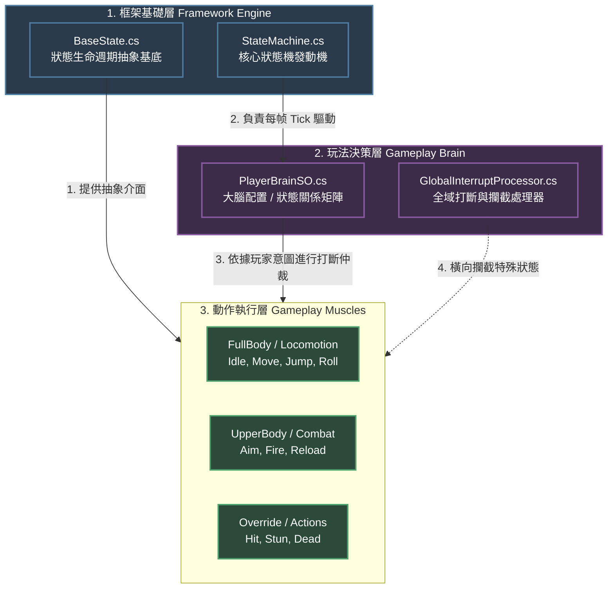

# 專案開發更新日誌 (Changelog & Learning Record)

---

## [v0.1] - 地基建設與基礎資料流驗證

### 1. 變更內容

* **核心資料結構建立**：實作了 `InputData` 類別、`IntentData` 結構體與資料中心黑板 `PlayerRuntimeData`。
* **輸入源與驅動器解耦**：定義 `IInputSource` 介面，並透過 Unity New Input System 實作 `PlayerInputSource`。
* **管線驅動核心**：建立 `CharacterPipelineRunner`，在 `Update` 中依序執行「採樣 $\rightarrow$ 轉化意圖 $\rightarrow$ 處理參數」，並在 `LateUpdate` 幀尾清空意圖。
* **簡易除錯器**：透過 `OnGUI` 實作初版 `BlackboardDebugViewer` 即時監控數據流。

### 2. 架構設計理由（Why）

* **意圖與參數分離**：`IntentData` 處理單幀觸發事件（如跳躍），其餘欄位處理連續數值（如移動速度），這能讓狀態機與動畫層各自獲取乾淨的資料。
* **結構體整體覆寫（零 GC）**：`IntentData` 採用 `struct` 設計，在幀尾透過 `Reset()` 覆寫欄位，完全避免了每幀產生的記憶體垃圾（GC Alloc）。

---

## [v0.2] - 命名規範落實與黑板封裝加固

### 1. 變更內容

* **程式碼命名規範嚴格化**：私有欄位全面重構為 `_camelCase`，公開屬性與欄位維持 `PascalCase`。
* **唯讀引用防護**：黑板新增 `CurrentWeapon` 與 `AimTarget` 引用欄位。將 `CurrentWeapon` 的 setter 權限設為 `internal`，嚴格限制外部模組的修改權限。
* **基礎 Dummy 類別補全**：新增 `ItemInstance` 空類別，確保專案在地基階段能直接通過編譯。

### 2. 架構設計理由（Why）

* **維護資料寫入邊界**：遵循規格書「新增黑板欄位必須明確誰寫誰讀」的規範，透過 `internal set` 鎖定寫入權，防止日後多處模組同時改寫同一數據而導致 Race Condition（競爭條件）。
* **防範 C# 結構體複製陷阱**：黑板中的 `Intent` 必須維持 **公開欄位 (Public Field)**。如果將其改成公開屬性 (Property)，C# 的 Property 語意會觸發 `struct` 的值複製機制，導致 `data.Intent.JumpRequested = true` 這類寫法直接編譯失敗（無法修改表達式產生的副本）。

---

## [v0.3] - 記憶體極致優化與除錯工具升級

### 1. 變更內容

* **InputData 破壞性升版**：將 `InputData` 由 class 改為 **`ref struct`**。
* **管線介面與驅動器重構**：
* `IInputSource` 簽名由回傳值改為傳址寫入：`void FetchRawInput(ref InputData data)`。
* `CharacterPipelineRunner` 的內部處理方法皆改為 `ref` 傳參。

* **黑板仲裁區配置**：引入 `ArbiterData` 結構體並嵌入黑板，預留第四階段（狀態打斷與表現層封鎖）的仲裁旗標。
* **管線順序加固**：在 `Update` 中加入 `BlockInput` 防禦線；在 `LateUpdate` 設立順序脆弱點防禦註解。
* **除錯面板重構（解決爆量塞不下問題）**：
* *方案 A*：在 `OnGUI` 中引入 `GUILayout.BeginScrollView` 與 `GUILayout.Toolbar`（分頁），解決固定佈局（Fixed Layout）無法承載維度增長的問題。
* *方案 B*：引入 `CustomEditor` 擴充，將運行時的數據流監視完全移交給 Unity Inspector，關閉 Runtime OnGUI 達到零效能損耗。

### 2. 架構設計理由（Why）

* **消滅鬼影資料風險 (Aliasing)**：在舊版本中，`InputData` 是 class，回傳的是記憶體參考。如果下游某個不守規矩的模組悄悄把這個參考存成成員變數，它就會在下一幀讀到被覆寫過的過期資料。
* **強迫編譯器當糾察隊**：`ref struct` 具有 **Stack-only（只能存活於堆疊）** 的特性。它不能被 class 持有、不能被裝箱 (Boxing)、不能用於 async。這等同於直接利用 C# 編譯器在底層建立一道防火牆，**100% 保證這份原始輸入資料絕不可能跨幀殘留**，且完全不消耗任何 Heap 記憶體。
* **面對資料維度爆量的 UI 哲學**：專案初期的 `OnGUI` 採用固定範圍，當黑板從原本的 3 個變數暴增到包含引用區、仲裁區等十幾個變數時，畫面必然重疊。透過 **Custom Editor** 把黑板可視化移到 Inspector，利用了編輯器原生自帶的滾動條與階層折疊特性。這不僅讓 Game 畫面回歸乾淨，更避免了 `OnGUI` 每幀因字串拼接（String Interpolation）而產生的垃圾記憶體（GC Alloc），是邁向 AAA 級工具鏈開發的重要思維。

---

## [v0.4] - 資料驅動分層狀態機與極致除錯整合（2026-07-02 ~ 2026-07-03）

### 1. 變更內容

* **分層狀態機骨架落地**：實作了 `FullBodyStateMachine` 主體與 `BaseState` 基底，並將其 Tick 正式接入 `CharacterPipelineRunner` 的【順序 4】。
* **資料驅動打斷系統**：實作 `StateMachineConfigSO` 藍圖，並建立實體檔案 `PlayerStateMachineConfig.asset`，允許透過 ScriptableObject 配置與共享狀態間的 `CanBeInterruptedBy`（主動意圖打斷）與 `ValidTransitions`（自然過渡順序）。
* **四大基礎狀態實作**：完成了 `Idle`、`Move`、`Jump`、`Roll` 狀態。在 `Jump` 與 `Roll` 中加入**時鐘模擬計時器**，在不接物理與動畫的前提下跑通狀態切換資料流。
* **模組目錄結構收攏重構**：為防範後續表現層與裝備系統接入時目錄失控，將所有檔案依據規格書向內收攏至 `Scripts/Core/` 目錄下（區分 `Blackboard`、`Pipeline`、`StateMachine/States`、`Arbitration`、`Editor`）。
* **解耦調試：原始輸入快照化**：因應 `InputData` 的 `ref struct` 限制，在 Runner 內部建立 `InputDebugSnapshot` 普通結構體，於每幀採樣完畢後進行值複製拷貝。
* **Inspector 高級擴充**：更新 `CharacterPipelineRunnerEditor`，新增「第 0 區：核心運行狀態與原始輸入」，利用亮色（Cyan）在編輯器端即時呈現角色當前所在的狀態機位置。
* **Animancer Lite v8 技術評估**：確認其在發行產品（Build）中**僅支援 Layer 0、不允許動態 new Mixer** 的底層限制。

### 2. 架構設計理由（Why）

* **狀態機的雙向評估思維**：在 `FullBodyStateMachine` 中，將狀態切換拆解為「主動意圖打斷（由 Input 驅動）」**與**「被動自然過渡（由狀態自身時鐘或參數驅動）」。這避免了在每個狀態內部寫死大量切換邏輯。
* **突破 ref struct 的記憶體邊界限制**：`ref struct` 無法作為 class 欄位且生命週期結束於 Stack 彈出，導致 Unity 的 `OnInspectorGUI` 循環根本摸不到它。透過在 Runner 中建立快照（`InputDebugSnapshot`）並在安全期「拓印」數值，**既保留了底層核心管線零 Heap GC 的極致效能，又完美解耦並滿足了開發時的可視化調試需求**。
* **資料與代碼完全分離（SO 哲學）**：`StateMachineConfigSO` 是食譜（代碼藍圖），而 `PlayerStateMachineConfig` 是蛋糕（資料檔案）。這樣設計能讓場景上 100 隻怪物共同引用同一個記憶體資產，達成零複製、完全共享的單一真理源（Single Source of Truth）。

---

### 3. 進階架構源碼研析：雙層 Core 與決策層解耦探討

透過對中大型先進控制器專案的目錄結構研析，發現其將狀態機拆分為：

1. `Character/Core/StateMachine` (內含抽象發動機與生命週期介面)
2. `Character/States/Core` (內含打斷處理器、大腦配置與狀態攔截器)
3. `Character/States/FullBody` (具體動作狀態實作)

#### 心得分流與對齊策略：

* **實現依賴倒置原則 (DIP)**：最頂層的 `Core/StateMachine` 屬於通用框架，不應該依賴具體玩法。抽離後，狀態機發動機成為完全泛用的工具。
* **打斷邏輯的制高點仲裁**：若將打斷邏輯寫在動作內部會導致高度耦合。獨立出玩法決策層（大腦），動作腳本只需專注於自身的物理與表現。
* **對齊策略**：目前專案處於地基驗證階段，戰術性地將決策簡化封裝在 `StateMachineConfigSO` 中。當未來第三、四階段引入複雜的複合按鍵、換彈、硬直打斷導致配置條目超過 15 筆時，將嚴格執行此重構，拆分出獨立的玩法大腦目錄。

---

## 5. 未來的重構訊號（Refactoring Triggers）

當你在接下來的第三、四階段（表現層解耦、Animancer Lite 接入、仲裁器接入）開發中看到以下現象，請立刻啟動重構：

1. **處理器肥大（超過 15 行）**：當 `CharacterPipelineRunner` 內的 `ProcessIntents` 或 `ProcessParameters` 開始塞滿各種複雜的複合按鍵（如長按、雙擊、組合鍵）判斷時 $\rightarrow$ 立刻實作規格書 **3.1 節**，將邏輯抽離成獨立的 `IIntentProcessor` 類別群。
2. **仲裁器重疊**：當未來多個狀態（如：定身 CC 狀態、過場動畫狀態）都需要封鎖輸入，導致單一的 `BlockInput = true` 無法分辨是誰封鎖、該由誰解鎖時 $\rightarrow$ 立刻實作規格書 **2.4 節**，引入 `ArbiterPipeline` 與優先級疊加系統。
3. **表現層受限突破**：若在實作 `AnimancerFacade` 時，單層骨骼遮罩（Avatar Mask）無法滿足複雜的全身/上半身動作混合需求 $\rightarrow$ 評估於發行 Build 時升級 Pro 版，或將部分靜態融合邏輯移回舊版 Animator Controller 作為 Facade 的混合後盾。